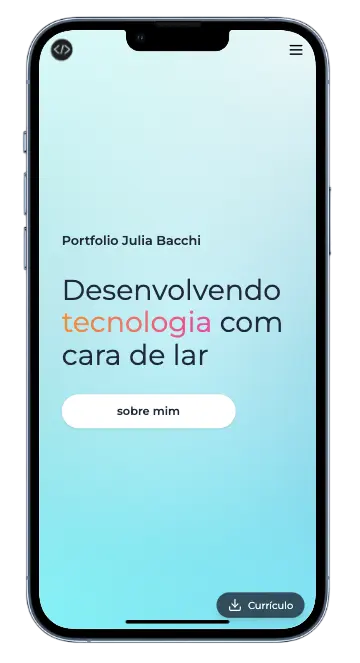

# 🌐 juliabacchi.com – Portfólio de Júlia Bacchi

**juliabacchi.com** é o meu portfólio como desenvolvedora front-end, onde compartilho projetos, experiências, habilidades e conteúdos sobre tecnologia. Criado com **Next.js + TailwindCSS + Framer Motion**, o site é um reflexo da minha personalidade e do meu cuidado com **acessibilidade, performance e UI/UX**.

[](https://opensource.org/licenses/MIT)  
[](https://nextjs.org/)  
[](https://juliabacchi.com)  
[](https://github.com/juliabacchi1/portfolio)



---

## 🛠️ Tecnologias

- [Next.js](https://nextjs.org/)
- [React](https://reactjs.org/)
- [TailwindCSS](https://tailwindcss.com/)
- [Framer Motion](https://www.framer.com/motion/)
- [Lucide Icons](https://lucide.dev/)
- [TypeScript](https://www.typescriptlang.org/)
- [MDX](https://mdxjs.com/)

---

## 🚀 Como rodar localmente

```bash
git clone https://github.com/juliabacchi1/juliadev-next.git
cd juliadev-next
npm install
npm run dev
```

---

## ✨ Funcionalidades
- 🧠 Destaque para tecnologias dominadas
- 🖼️ Projetos em destaque com carrossel interativo
- 📝 Blog com posts interativos sobre tecnologia e dia a dia
- 🔍 Interface responsiva, acessível e com animações suaves
- 💌 Seção de contato integrada com redes sociais e botão de navegação para o blog
- 🌥️ Design criativo com fundo ilustrativo (como nuvens)

## 📂 Estrutura do projeto

```
src/
|
app/
├── components/
│ ├── blog/             # Card principal, post footer
│ │     └── contents/   # Conteúdo dos posts
│ │     └── data/       # Dados extraídos para os posts
│ │
│ ├── AboutSection.tsx
│ ├── BlogSection.tsx
│ ├── Button.tsx
│ ├── ContactSection.tsx
│ ├── HeroSection.tsx
│ ├── NavBar.tsx
│ ├── TechSection.tsx
│ ├── WorkSection.tsx
│ └── Footer.tsx
│
├── layout.tsx
└── page.tsx
```

## 🧩 Próximos passos
- 🛎️ Adicionar dark mode
- 🧠 Publicar mais conteúdos técnicos sobre front-end e carreira dev
- 📈 Adicionar analytics para acompanhar acessos

## 💡 Visão e identidade
Este portfólio representa meu momento atual como desenvolvedora e criadora. Busquei um design que unisse leveza visual com tecnologia moderna, refletindo minha paixão por inovação, criatividade, sustentabilidade e pessoas. Cada detalhe – dos ícones aos textos – foi pensado para contar um pouco da minha história.

## 🙋‍♀️ Feito por
Julia Bacchi – desenvolvedora front-end apaixonada por tecnologia, natureza, criatividade e bons desafios.
[LinkedIn](https://www.linkedin.com/in/juliabacchi/) | [Portfólio](https://juliabacchi.com)

## 🪄 Contribuições
Se quiser sugerir melhorias, abrir issues ou simplesmente trocar uma ideia, fique à vontade! Toda troca é bem-vinda. 💛

## 📄 Licença
MIT © Júlia Bacchi
